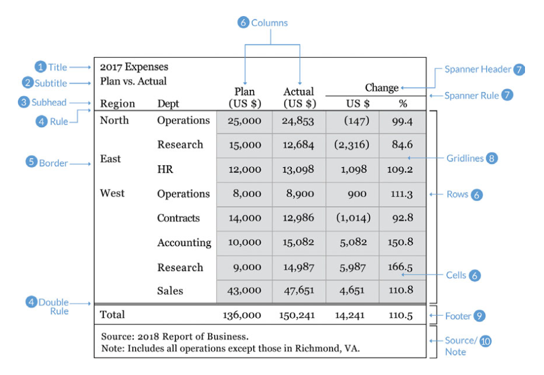
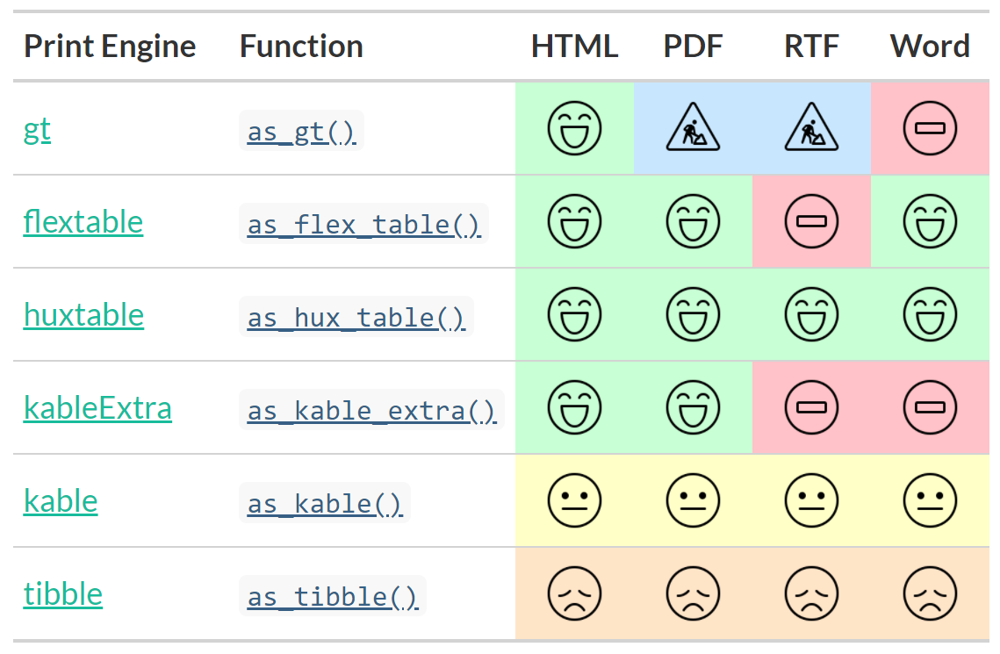

class: left, middle

## Tabela

- sposób prezentacji służący do wyszukiwania i porównywania pojedynczych wartości

## Wykres

- sposób prezentacji służący do odkrywania zależności między zbiorami wartości i ich ogólnego kształtu

<br><br><br><br>

.right[Stephen Few (2012) *Show Me the Numbers*]
<!-- Few Stephen, Show Me the Numbers: Designing Tables and Graphs to Enlighten, Analytics Press (2012) -->


---
class: center, middle, inverse

```{r fig.align="default", out.width="100%", echo=FALSE}
# Michael: what really?
knitr::include_graphics(
"https://media.giphy.com/media/OgAj1L5HkPi2vjjD76/source.gif"
)
```


---
class: center, middle, inverse

```{r fig.align="default", out.width="80%", echo=FALSE}
# Trump: I think it's a terrible thing
knitr::include_graphics(
"https://media.giphy.com/media/uHrhRdPTnFGFKCCklv/source.gif"
)
```


---
class: center, middle, inverse

```{r fig.align="default", out.width="100%", echo=FALSE}
# (Let me think) No
knitr::include_graphics(
"https://media.giphy.com/media/tCYMesnacJ6cE/source.gif"
)
```


---
class: center, middle, inverse

```{r fig.align="default", out.width="100%", echo=FALSE}
# The Office: Michael: Nooooooo
knitr::include_graphics(
"https://media.giphy.com/media/d10dMmzqCYqQ0/source.gif"
)
```


---
class: center, middle

```{r fig.align="default", out.width="80%", echo=FALSE}
# grammar of tables

```

.right[
Jonathan A. Schwabish, *Ten Guidelines for Better Tables*<br>
J. Benefit Cost Anal. 2020; 11(2):151–178, doi:10.1017/bca.2020.11
]


---
class: center, middle

```{r fig.align="default", out.width="100%", echo=FALSE}
# R
knitr::include_graphics(
"images/R_logo.svg"
)
```


---
class: top, left

#### Pakiety / funkcje tworzące tabele:

<br><br>

- knitr::kable
- kableExtra
- gt / gtExtras
- flextable / ftExtra
- xtable
- huxtable
- htmlTable
- stargazer
- formattable
- pixiedust
- pander
- tangram
- ztable
- condformat


---
class: top, left

#### Przygotujmy dane...

```{r}
islands_tb <- tibble(name = names(islands), size = islands) |>
  arrange(desc(size)) |>
  slice(1:10)

gt(islands_tb)
```


---
class: top, left

#### ...i dopracujmy szczegóły...

```{r echo=FALSE}
gt(islands_tb) |>
  tab_header(
    title = md("**Large Landmasses of the World**"),
    subtitle = "The top ten largest are presented") |>
  tab_source_note(source_note = "Source: The World Almanac
    and Book of Facts, 1975, page 406.") |>
  tab_source_note(source_note = md("Reference: McNeil, D. R.
    (1977) *Interactive Data Analysis*. Wiley.")) |>
  tab_footnote(
    locations = cells_column_labels(size),
    footnote = "In Thousands of Square Miles") |>
  tab_options(table.width = px(450))
```


---
class: top, left

#### ...w ten sposób:

```{r eval=FALSE}
gt(islands_tb) |>
  tab_header(
    title = md("**Large Landmasses of the World**"),
    subtitle = "The top ten largest are presented") |>
  tab_source_note(source_note = "Source: The World Almanac
    and Book of Facts, 1975, page 406.") |>
  tab_source_note(source_note = md("Reference: McNeil, D. R.
    (1977) *Interactive Data Analysis*. Wiley.")) |>
  tab_footnote(
    locations = cells_column_labels(size),
    footnote = "In Thousands of Square Miles") |>
  tab_options(table.width = px(450))
```

```{r fig.align="center", out.width="60%", echo=FALSE}
# Office / Jim & Daryl: fist
knitr::include_graphics(
"https://media.giphy.com/media/UjCXeFnYcI2R2/source.gif"
)
```


---
class: center, middle

```{r fig.align="default", out.width="100%", echo=FALSE}
# grammar of tables
knitr::include_graphics(
"images/gt_parts_of_a_table.svg"
)
```


---
class: center, top, inverse

```{r fig.align="default", out.width="100%", echo=FALSE}
# Spock: Logical
knitr::include_graphics(
"https://media.giphy.com/media/iXTrbbYMQBCMM/source.gif"
)
```


---
class: top, left

#### Dane finansowe!

<br><br>

```{r echo=FALSE}
up_arrow   <- "<span style=\"color:green\">&#9650;</span>"
down_arrow <- "<span style=\"color:red\">&#9660;</span>"

start_date <- "2012-06-21"
end_date <- "2012-06-28"
sp500 |>
  filter(date >= start_date & date <= end_date) |>
  select(-adj_close) |>
  arrange(date) |>
  gt() |>
  tab_header(title = "S&P 500",
             subtitle = glue("{start_date} to {end_date}")) |>
  fmt_date(columns = date, date_style = 1) |>
  fmt_currency(columns = c(open, high, low, close), currency = "USD") |>
  fmt_number(columns = volume, scale_by = 1 / 1E9, pattern = "{x}B") |>
  fmt_number(columns = volume, suffixing = TRUE) |>
  text_transform(
    locations = cells_body(columns = close, rows = close > open),
    fn = function(x) paste(x, up_arrow)) |>
  text_transform(
    locations = cells_body(columns = close, rows = close < open),
    fn = function(x) paste(x, down_arrow)) |>
  cols_label(date = "Date", open = "Open", high = "High",
    low = "Low", close = "Close", volume = "Volume")
```

---
class: top, left

#### Bardziej złożona struktura

```{r echo=FALSE}
# https://towardsdatascience.com/exploring-the-gt-grammar-of-tables-package-in-r-7fff9d0b40cd
penguins <- palmerpenguins::penguins
pen_emoji <- paste(rep(emo::ji("penguin"), 3), collapse = " ")
penguins |>
  tibble() |>
  filter(species == "Adelie") |>
  filter(island != "Torgersen") |>
  group_by(sex, island, year) |>
  summarise_if(is.numeric, sum) |>
  filter(!is.na(sex)) |>
  pivot_wider(names_from = sex, values_from = c(bill_length_mm, bill_depth_mm, flipper_length_mm, body_mass_g)) |>
  mutate(island = paste(island, "Island")) |>
  gt(rowname_col = "year") |>
  tab_spanner(label = "Samce", columns = ends_with("_male")) |>
  tab_spanner(label = "Samice", columns = ends_with("_female")) |>
  summary_rows(groups = TRUE, columns = everything(), fns = list(Średnia = "mean"), formatter = fmt_number, use_seps = TRUE, decimals = 0) |>
  fmt_number(columns = everything(), decimals = 0) |>
  tab_header(
    title = md(paste(pen_emoji, "  Wszystko o pingwinach Adelie  ", pen_emoji)),
    subtitle = "Roczne pomiary długości i wysokości dzioba, długości płetwy i masy ciała") |>
  tab_options(footnotes.multiline = FALSE, footnotes.sep = "; ") |>
  tab_footnote(footnote = "w milimetrach", locations = cells_column_labels(columns = contains("mm"))) |>
  tab_footnote(footnote = "w gramach",     locations = cells_column_labels(columns = contains("mass_g"))) |>
  tab_source_note("Dane: Dr. Kristen Gorman & Palmer Station Antarctica LTER; Pomysł: Manasi Mahadik") |>
  cols_label(
    bill_length_mm_male = "Długość dzioba",
    bill_depth_mm_male = "Wysokość dzioba",
    flipper_length_mm_male = "Długość płetwy",
    body_mass_g_male = "Masa ciała",
    bill_length_mm_female = "Długość dzioba",
    bill_depth_mm_female = "Wysokość dzioba",
    flipper_length_mm_female = "Długość płetwy",
    body_mass_g_female = "Masa ciała") |>
  cols_align(align = "right", columns = everything()) |>
  tab_style(style = list(cell_text(align = "center", weight = "bold")),
            locations = list(cells_title(groups = "title"))) |>
  tab_style(style = list(cell_text(align = "center", weight = "bold")),
            locations = list(cells_title(groups = "subtitle"))) |>
  tab_style(style = list(cell_text(align = "center")),
            locations = cells_column_spanners(spanners = c("Samice", "Samce"))) |>
  tab_style(style = list(cell_text(weight = "bold")),
            locations = list(cells_column_labels(everything()))) |>
  tab_style(style = list(cell_text(align = "center", weight = "bold")),
            locations = list(cells_row_groups(groups = paste(c("Biscoe", "Dream"), "Island")))) |>
  tab_style(style = list(cell_text(align = "center", weight = "bold")),
            locations = cells_summary(groups = TRUE, columns = everything())) |>
  tab_style(style = list(cell_text(align = "center")),
            locations = list(cells_body(columns = everything()))) |>
  opt_all_caps() |>
  opt_table_outline(style = "solid", width = px(3))
```


---
class: top, left

#### Statystyki i podsumowania:

<br>

```{r echo=FALSE}
# Create a gt table based on a preprocessed `pizzaplace`
pizzaplace |>
  filter(type %in% c("classic", "veggie")) |>
  dplyr::group_by(type, size) |>
  dplyr::summarize(
    sold = n(),
    income = sum(price),
    .groups = "drop_last"
  ) |>
  gt(rowname_col = "size") |>
  tab_header(title = "Pizzas Sold in 2015") |>
  fmt_number(columns = sold, decimals = 0, use_seps = TRUE) |>
  fmt_currency(columns = income, currency = "USD") |>
  summary_rows(groups = TRUE, columns = sold, fns = list(TOTAL = "sum"),
    formatter = fmt_number, decimals = 0, use_seps = TRUE) |>
  summary_rows(groups = TRUE, columns = income, fns = list(TOTAL = "sum"), formatter = fmt_currency, currency = "USD") |>
  tab_options(
    summary_row.background.color = "#ACEACE",
    row_group.background.color = "#FFEFDB",
    table.font.size = 12
  )
```


---
class: top, left

#### Elementy graficzne: wyróżnianie kolorem

<br><br>

```{r echo=FALSE}
n <- 8
mtcars |>
  tibble::rownames_to_column("car") |>
  select(car, mpg:hp) |>
  head(n) |>
  gt() |>
  gt_highlight_rows(rows = 5, fill = "lightgrey", bold_target_only = TRUE, target_col = car) |>
  gt_highlight_cols(cyl, fill = "red", alpha = 0.5) |>
  gt_color_rows(cyl, domain = range(mtcars$cyl[1:n]), palette = "ggsci::blue_material") |>
  gt_color_box(hp, domain = range(mtcars$hp[1:n]), palette =  c("red", "orange", "yellow", "green"))  |>
  tab_options(table.font.size = 24)
```


---
class: top, left

#### Elementy graficzne: formatowanie warunkowe

<br>

```{r echo=FALSE}
dimnames <- list(start(nottem)[1]:end(nottem)[1], month.abb)
temps <- matrix(nottem, ncol = 12, byrow = TRUE, dimnames = dimnames) |> 
  data.frame() |>
  tibble::rownames_to_column() |> 
  head(10)
temps |> 
  gt() |> 
  data_color(
    columns = all_of(month.abb),
    colors = scales::col_numeric(
      c("#63be7b", "#ffeb84", "#f87274"),
      domain = range(nottem))
  )
```

---
class: top, left

#### Elementy graficzne: ikony

<br><br>

```{r echo=FALSE}
set.seed(37)
mtcars |>
  dplyr::slice(1:7) |>
  dplyr::mutate(rating = sample(1:5, size = 7, TRUE)) |>
  dplyr::mutate(change = c(1:3, -1, -2, -5, 0)) |>
  dplyr::select(change, mpg, cyl, drat, rating) |>
  gt() |>
  gt_fa_repeats(cyl, name = "car") |>
  gt_fa_rating(rating, icon = "r-project") |>
  gt_fa_rank_change(change,
                    font_color = "match",
                    palette = c("#ff4343", "#43bb43", "#9f9f9f")) |>
  tab_options(table.font.size = 24)
```


---
class: top, left

#### Elementy graficzne: wykres słupkowy

<br><br><br><br>

```{r echo=FALSE}
mtcars |>
  head() %>%
#  dplyr::mutate(cars = sapply(strsplit(rownames(.), " "), `[`, 1)) |>
  dplyr::mutate(cars = rownames(.)) |>
  dplyr::select(cars, mpg, disp) |>
  gt() |>
  gt_plt_dot(disp, cars, palette = "ggthemes::fivethirtyeight") |>
  cols_width(cars ~ px(250)) |>
  tab_options(table.font.size = 24)
```

---
class: top, left

#### Elementy graficzne: przedziały ufności

<br><br><br><br>

```{r echo=FALSE}
generate_df(
  n = 50,
  n_grps = 3,
  mean = c(10, 15, 20),
  sd = c(10, 10, 10),
  with_seed = 37
) |>
  mutate(grp = LETTERS[as.integer(substr(grp, 5, 5))]) |>
  dplyr::group_by(grp) |>
  dplyr::summarise(
    n = dplyr::n(),
    avg = round(mean(values), 1),
    sd = round(sd(values), 1),
    list_data = list(values)
  ) |>
  gt() |>
  gt_plt_conf_int(list_data,
                  ci = 0.99,
                  text_size = 3,
                  width = 90,
                  text_args = list(accuracy = 0.1)) |>
  cols_label(grp = "Group",
             avg = "Mean",
             sd = "St. dev.",
             list_data = "99% Conf. Int.") |>
  tab_style(style = list(cell_text(align = "center")),
            locations = list(cells_column_labels(everything()))) |>
  tab_options(data_row.padding = px(5)) |>
  tab_options(table.font.size = 24)
```


---
class: top, left

#### Elementy graficzne: sukcesy i porażki

<br><br><br>

```{r echo=FALSE}
set.seed(37)
dplyr::tibble(
  Team = rep(c("A", "B", "C"), each = 10),
  WL = sample(c(0,1,.5), size = 30, prob = c(0.45, 0.45, 0.1), replace = TRUE)
) |>
  dplyr::group_by(Team) |>
  dplyr::summarize(`Wins & Loses` = list(WL), .groups = "drop") |>
  gt() |>
  gt_plt_winloss(`Wins & Loses`) |>
  tab_options(table.font.size = 30)
```

---
class: top, left

#### Elementy graficzne: rozkład

<br><br><br>

```{r echo=FALSE}
mtcars |>
  dplyr::group_by(cyl) |>
  # must end up with list of data for each row in the input dataframe
  summarize(mpg_data = list(mpg), .groups = "drop") |>
  mutate(density = mpg_data,
         histogram = mpg_data,
         boxplot = mpg_data) |>
  select(-mpg_data) |>
  gt() |>
  gt_plt_dist(density,   type = "density",   fig_dim = c(15, 50)) |>
  gt_plt_dist(histogram, type = "histogram", fig_dim = c(15, 50)) |>
  gt_plt_dist(boxplot,   type = "boxplot",   fig_dim = c(15, 50)) |>
  tab_options(table.font.size = 30)
```


---
class: top, left

#### Elementy graficzne: pytania ankietowe (2/3 odpowiedzi)

<br><br><br>

```{r echo=FALSE}
dplyr::tibble(
  `Do you like it?` = rep(paste("Example", 1:4), each = 3),
  measure = rep(paste("Measure", 1:3), times = 4),
  data = c(60, 20, 20, 50, 15, 35, 40, 10, 50, 30, 5, 65)) |>
  group_by(`Do you like it?`) |>
  summarise(list_data = list(data)) |>
  gt() |>
  gt_plt_bar_stack(column = list_data,
                   palette = c("#ff4343", "#9f9f9f", "#43bb43"),
                   labels = c("No", "I don't care", "Yes"),
                   width = 100) |>
  tab_options(table.font.size = 30)
```


---
class: top, left

#### Elementy graficzne: sparklines

<br><br><br>

```{r echo=FALSE}
mtcars |>
  dplyr::group_by(cyl) |>
  # must end up with list of data for each row in the input dataframe
  dplyr::summarize(mpg_data = list(mpg), .groups = "drop") |>
  gt() |>
  gt_plt_sparkline(mpg_data, fig_dim = c(20, 60),
                   label = FALSE, same_limit = TRUE) |>
  tab_options(table.font.size = 30) |>
  cols_label(mpg_data = "mpg")
```

---
class: top, left

#### Elementy graficzne: obrazy

<br><br><br>

```{r echo=FALSE}
teams <- "https://github.com/nflverse/nflfastR-data/raw/master/teams_colors_logos.rds"
team_df <- readRDS(url(teams))

team_df |>
   dplyr::select(team_wordmark, team_abbr, logo = team_logo_espn, team_name:team_conf) |>
   head() |>
   gt() |>
   gt_img_rows(columns = team_wordmark, height = 25) |>
   gt_img_rows(columns = logo, img_source = "web", height = 30) |>
   tab_options(data_row.padding = px(1))
```


---

#### Pakiety / funkcje do tabeli wielodzielczych, statystyk, itd.:

<br><br>

- gtExtras::gt_pl_summary
- gtsummary
- modelsummary
- finalfit
- crosstable
- huxtable
- stargazer
- sjPlot
- texreg
- apsrtable

---
class: top, left

#### Tablice wielodzielcze / statystyki: gtExtras

```{r eval=FALSE}
gtExtras::gt_plt_summary(datasets::ChickWeight)
```

<br>

```{r echo=FALSE}
gtExtras::gt_plt_summary(datasets::ChickWeight)
```

---
class: top, left

#### Tablice wielodzielcze / statystyki: gtsummary

```{r eval=FALSE}
gtsummary::tbl_cross(gapminder, row = continent, col = year)
```

<br>

```{r echo=FALSE}
gtsummary::tbl_cross(gapminder, row = continent, col = year)
```

---
class: top, left

#### Tablice wielodzielcze / statystyki: crosstable

```{r eval=FALSE}
crosstable::crosstable(mtcars, c(mpg, cyl), by=am) |>
  crosstable::as_flextable(keep_id=FALSE)
```

<br>

```{r echo=FALSE}
crosstable::crosstable(mtcars, c(mpg, cyl), by=am) |>
  crosstable::as_flextable(keep_id=FALSE)
```


---
class: top, left

#### Regresja: gtsummary

<br>

```{r}
lm_add <- lm(Volume ~ Height + Girth, data=trees)
tb_add <- tbl_regression(lm_add)
lm_int <- lm(Volume ~ Height * Girth, data=trees)
tb_int <- tbl_regression(lm_int)
tbl_merge(
  tbls = list(tb_add, tb_int),
  tab_spanner = c("**Additive**", "**Interactive**")
)
```


---
class: top, left

#### Regresja: huxtable

```{r}
huxreg(lm(mpg~cyl, mtcars), lm(mpg~hp, mtcars), lm(mpg~cyl+hp, mtcars))
```


---
class: top, left

#### modelsummary: statystyki opisowe

```{r}
datasummary_skim(penguins)
datasummary_correlation(penguins[, 3:6])
```

---
class: top, left

#### modelsummary: tablica wielodzielcza

```{r}
datasummary_crosstab(species ~ sex, data = penguins)
```


---
class: top, left

#### modelsummary: regresja

```{r eval=FALSE}
url <- 'https://vincentarelbundock.github.io/Rdatasets/csv/HistData/Guerry.csv'
dat <- read.csv(url)

models <- list(
  "OLS 1"   = lm(Crime_pers ~ Literacy + Clergy, data = dat),
  "OLS 2"   = lm(Crime_pers ~ Literacy + Commerce, data = dat),
  "Poisson" = glm(Crime_pers ~ Literacy + Commerce, family = poisson, data = dat)
)

modelsummary(
  models,
  fmt = 1,
  estimate  = "{estimate} [{conf.low}, {conf.high}]",
  statistic = NULL,
  coef_omit = "Intercept")
```


---
class: top, left

#### modelsummary: regresja

```{r echo=FALSE}
url <- 'https://vincentarelbundock.github.io/Rdatasets/csv/HistData/Guerry.csv'
dat <- read.csv(url)

models <- list(
  "OLS 1"   = lm(Crime_pers ~ Literacy + Clergy, data = dat),
  "OLS 2"   = lm(Crime_pers ~ Literacy + Commerce, data = dat),
  "Poisson" = glm(Crime_pers ~ Literacy + Commerce, family = poisson, data = dat)
)

modelsummary(
  models,
  fmt = 1,
  estimate  = "{estimate} [{conf.low}, {conf.high}]",
  statistic = NULL,
  coef_omit = "Intercept")
```


---
class: center, top, inverse

```{r fig.align="default", out.width="80%", echo=FALSE}
# Bill Murray: You got this
knitr::include_graphics(
"https://media.giphy.com/media/11F0d3IVhQbreE/source.gif"
)
```


---
class: top, left

#### Wsparcie dla formatów wyjściowych

<br>

```{r fig.align="default", out.width="100%", echo=FALSE}
# output formats

```


---
class: top, left

#### Tabele interaktywne

<br><br>

- DT
- reactable / reactablefmtr

---
class: top, left

#### DT

```{r}
DT::datatable(iris)
```

---
class: top, left

#### reactable

```{r}
reactable::reactable(iris)
```


---
class: top, left

#### Inspiracje

<br><br>

- [Thomas Mock, *10+ Guidelines for Better Tables in R*](https://themockup.blog/posts/2020-09-04-10-table-rules-in-r/)

- [RStudio Community Table Gallery](https://www.rstudio.com/blog/rstudio-community-table-gallery/)

- [Winners of the 2021 Table Contest](https://www.rstudio.com/blog/winners-of-the-2021-table-contest/)

- [Winners of the 2020 RStudio Table Contest](https://www.rstudio.com/blog/winners-of-the-2020-rstudio-table-contest/)


---
class: left, top

.small[
W prezentacji wykorzystano:
- Logo R: Autorstwa Hadley Wickham and others at RStudio <br> https://www.r-project.org/logo/, CC BY-SA 4.0, 
- GIFy z serwisu Giphy.com
- program R i następujące pakiety, zawarte w nich zestawy danych i przykłady:
dplyr, tidyr, glue, knitr, xaringan, palmerpenguins, gapminder, gt, gtExtras, gtsummary, crosstable, huxtable, modelsummary, reactable, DT
]


---
class: center, middle, inverse

```{r fig.align="default", out.width="90%", echo=FALSE}
# Office / Jim: Thank you
knitr::include_graphics(
"https://media.giphy.com/media/M9NbzZjAcxq9jS9LZJ/giphy.gif"
)
```

